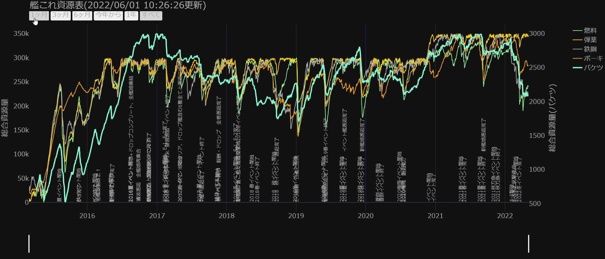

# kancolle_material_viewer

## なにこれ
- 艦これの資源をexcel管理したものを可視化するためのスクリプト
- excelのグラフでいいけど、より詳細なものが欲しい
- excelファイルを入力に、以下のような可視化htmlを出力する
    - 
- 時間単位での定期実行も実装

## excel仕様
- 以下のシートがあることを想定して実装している
    - `資源メモ` (コマンドライン引数で変更可能)
- 以下のカラムがあることを想定して実装している
    - 燃料
    - 弾薬
    - 鉄鋼
    - ボーキ
    - バケツ
- 詳細はリポジトリ内のテスト用excelファイルを参照
    - バケツのデータが最初無いのは、作者が途中で記録し始めたため
